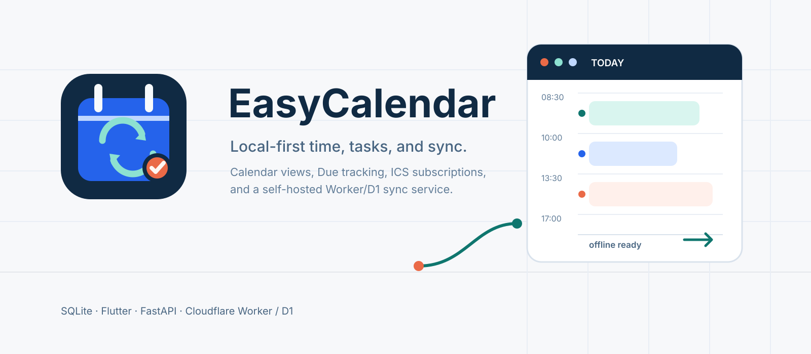
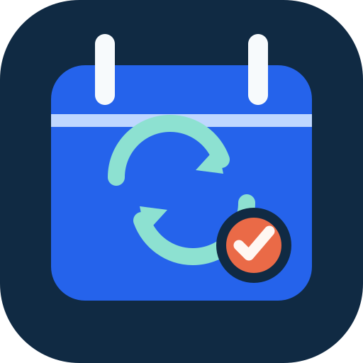

<p align="center">
  <picture>
    <source media="(prefers-color-scheme: dark)" srcset="public/brand/easycalendar-github-hero.svg">
    
  </picture>
</p>

<h1 align="center">EasyCalendar</h1>

<p align="center">
  <strong>本地优先 · 可自托管 · 离线可用</strong>
  <br />
  Local-first, self-hostable personal calendar &amp; due manager.
</p>

<p align="center">
  <a href="https://github.com/lvxin1024/text2calendar/actions"></a>
  <a href="LICENSE"></a>
  <a href="https://flutter.dev"></a>
</p>

<p align="center">
  
</p>

---

## 这是什么？ / What is this?

**EasyCalendar** 是一个面向个人的日程与 Due 管理工具。你可以离线使用它，也可以连接自己的同步服务在多设备间同步数据。

- 🇨🇳 用中文自然语言写日程（"明天上午9点开会"），规则引擎自动解析
- 📅 日/周/月视图、Due 管理、标签筛选、循环日程
- 💻 macOS / Windows / Android 三平台 Flutter 桌面客户端
- 🔒 数据完全在你手里：本地 SQLite 存储，可选自托管同步服务
- 🤖 可选 AI 助手（OpenAI / Ollama），确认后才写入正式日程
- 📡 支持 ICS 日历订阅（客户端本地条件抓取）

> **EasyCalendar** is a personal calendar & due manager. Use it fully offline, or connect your own sync server for multi-device sync. Natural-language parsing, day/week/month views, due management, tag filters, recurrence — all stored in your local SQLite database.

---

## ✨ 功能 / Features

| 功能 Feature | 说明 Description |
|---|---|
| 📝 中文规则解析 | 把"明天上午9点开会"解析为待确认的日程候选，不依赖 AI |
| 📅 日历视图 | 单日 24 小时时间轴、周视图、月视图，重叠事件自动分栏 |
| ✅ Due 管理 | 任务截止日期追踪，日历视图顶部置顶显示 |
| 🏷️ 标签筛选 | 自定义标签颜色，跨视图一致筛选 |
| 🔁 循环日程 | 每天/工作日/每周/每月/每年 RRULE，范围查询展开 |
| 🤖 AI 助手 | OpenAI-compatible / Ollama 多 Provider，候选预览确认后写入 |
| 📡 ICS 订阅 | 外部日历只读导入独立 Collection，ETag 条件抓取 |
| 📦 导入导出 | JSON 全量备份、ICS 文件导入，预览后提交 |
| 🗑️ 回收站 | 软删除恢复，乐观锁幂等保护 |
| 🔔 通知提醒 | 平台通知适配接口，提醒改期自动协调 |
| 🔄 自动同步 | outbox push / cursor pull，确定性冲突恢复，网络恢复自动重试 |
| 🪟 桌面窗口 | macOS/Windows 透明度、置顶、点击穿透，桌面日历 overlay |
| 🧩 macOS Widget | App Group 离线 timeline，快照损坏容错 |

---

## 🚀 下载与使用 / Getting Started

普通用户只需下载对应平台的 [GitHub Release](https://github.com/lvxin1024/text2calendar/releases) 安装包，安装后选择“仅本地使用”即可进入 App。本地日历、Due、提醒、备份、ICS 导入导出、网址订阅和基础中文解析都在客户端内完成。

**使用安装包不需要 Python、Flutter、Node.js，也不需要修改配置文件或环境变量。** 设备 ID 会在首次启动时自动生成，其他运行时选项都可以在 App 设置中管理。

需要更强的自然语言理解时，在“设置 > AI Provider”中配置 OpenAI-compatible、DeepSeek 或 Ollama。App 会直接请求该 Provider，API Key 保存在系统安全存储中，不需要 Python Core 中转。

### 组件边界

| 组件 | 是否必需 | 说明 |
|---|---|---|
| **EasyCalendar App** | 是 | macOS / Windows / Android 客户端，内置 SQLite，离线可用 |
| **Cloud Sync** | 否 | Cloudflare Worker / D1 多设备同步服务 |
| **Python Compatibility API** | 否 | 面向开发者和第三方集成的参考 REST API，不在 App 主链路上 |

---

## ☁️ 可选：多设备同步

多设备同步服务。部署后各客户端通过它交换 outbox 变更。

```
┌──────────┐     ┌──────────────────┐     ┌──────────┐
│  macOS   │ ←→  │  Cloudflare       │ ←→  │  Windows │
│  Client  │     │  Worker + D1      │     │  Client  │
└──────────┘     └──────────────────┘     └──────────┘
```

Cloudflare Worker + D1 是当前唯一实现的多设备同步服务器。配置和部署命令在一台装有本仓库、Node.js 22 的开发电脑上执行即可，Worker 和数据库最终运行在你的 Cloudflare 账户中，不需要把 Worker 部署到已有远程服务器。

**前提**：Node.js 22、Cloudflare 账号，以及一个准备使用的 `workers.dev` 地址或已接入 Cloudflare 的自定义域名。

先在仓库根目录创建不会提交到 Git 的本地配置：

```bash
cp config/app.example.yaml config/app.yaml
cp config/secrets.example.env config/secrets.env
```

编辑 `config/app.yaml`。以下配置可直接作为 Cloudflare 部署模板；把域名和实例名替换成自己的值：

```yaml
app:
  name: EasyCalendar
  instance_name: lvxin-easycalendar
  timezone: Asia/Shanghai
  locale: zh-CN

server:
  mode: cloudflare
  public_url: https://calendar.example.com
  cors_allowed_origins:
    - https://calendar.example.com

storage:
  driver: d1
  sqlite_path: ./data/app.sqlite3
  backup_dir: ./data/backups

sync:
  enabled: true
  pull_limit: 200
  retry_limit: 8

deployment:
  provider: cloudflare
  auto_migrate: true
  auto_backup_before_migrate: true
```

- `app.instance_name` 只能包含小写字母、数字和连字符，会生成 `<instance_name>-server` Worker 和 `<instance_name>-db` D1 数据库。
- `server.public_url` 必须是最终公开的 HTTPS 地址，不能带路径。可填写 `https://<worker>.<account>.workers.dev`，也可填写 Cloudflare 中已托管 DNS 的自定义域名。
- `cors_allowed_origins` 不接受 `*`。原生 macOS、Windows、Android 客户端不依赖浏览器 CORS；暂时可以填写与 `public_url` 相同的 origin，未来增加 Web 客户端时再加入其 HTTPS origin。

生成至少 32 字符的随机访问令牌：

```bash
openssl rand -hex 32
```

把输出只写入 `config/secrets.env`：

```dotenv
ADMIN_TOKEN=<上一步生成的 64 位十六进制字符串>
AI_API_KEY=
```

然后安装 Worker 依赖、登录 Cloudflare、校验并部署：

```bash
./scripts/setup.sh install
cd server
npx wrangler login
cd ..

./scripts/setup.sh validate --config config/app.yaml
./scripts/setup.sh --config config/app.yaml
```

登录授权发生在浏览器中，选择实际持有域名/D1 的 Cloudflare 账户。部署脚本会自动创建 D1 数据库、执行 migration、部署 Worker、写入 `ADMIN_TOKEN` secret，并请求 `/v1/health` 验证结果。不要手工编辑 `server/wrangler.jsonc`；生成状态保存在已忽略的 `server/.generated/`。

#### 客户端设置

在每台设备打开“设置 > 连接”，填写并保存：

| 设置项 | 如何填写 | 示例 |
|---|---|---|
| **同步服务地址** | 所有设备填写同一个 Cloudflare Worker HTTPS 地址 | `https://calendar.example.com` |
| **同步服务令牌** | Cloudflare Worker 的 `ADMIN_TOKEN`；需要同步的设备填写同一个值 | 上面生成的 64 位字符串 |
| **设备名称** | 用于区分设备，可按习惯修改 | `工作电脑`、`手机` |
| **默认日历** | 从 App 中已有的可写日历中选择 | `我的日程` |
| **同步** | 打开开关，保存后点击“立即同步” | 开启 |

新设备需要连接已有同步日历时，先在原设备复制“日历配置码”，再在新设备选择“连接已有日历”并粘贴。Collection ID 由 App 自动维护，普通用户不需要填写；只在高级连接设置中提供查看和复制。

这些设置会持久化在当前安装中。同步令牌保存在系统安全存储中；“测试连接”会检查网络、TLS、鉴权、API 版本和同步能力，不会修改日历数据。设备 ID 会自动生成并长期保存，只应在复制安装、身份冲突或排查同步问题时使用高级设置中的“重建设备身份”。

#### Cloudflare 与已有远程服务器如何分工

- **Cloudflare 账户**：配置和运行 Worker、D1、同步域名及 `ADMIN_TOKEN`，客户端同步地址指向这里。
- **已有远程服务器/VPS**：可选，只在需要 Python Compatibility API 时使用；它与 App 的本地功能和云同步链路都相互独立。
- **客户端设备**：各自保存本地 SQLite 数据；需要多设备同步时连接同一个 Worker，但使用各自唯一的设备 ID。

> 当前尚未实现 Docker Compose 一键部署、全套 VPS 同步部署和自动 D1 备份/回滚。不要把 Python Compatibility API URL 填成同步 API 地址。

---

## 🛠️ 开发者指南 / Development

### 从源码运行 App

Flutter 3.44.9 是开发环境依赖，不是普通用户的安装依赖。

```bash
git clone https://github.com/lvxin1024/text2calendar.git
cd text2calendar
./scripts/setup-client.sh
./scripts/run-client.sh
```

也可以进入 `client/` 目录直接执行 `flutter pub get` 和 `flutter run -d <device-id>`。`config/client.json` 只用于定制首次启动默认值；运行时配置仍以 App 设置为准。

### Python Compatibility API（可选）

仓库根目录的 `src/` 保留了规则解析、导入导出和 AI 助手等 REST API 的参考实现，可用于第三方客户端、兼容性测试或服务端扩展。它不承担多设备同步，也不是 EasyCalendar App 的运行依赖。

```bash
python3 -m venv .venv
.venv/bin/pip install -r requirements.txt
.venv/bin/python run.py
# API: http://localhost:8000
# OpenAPI docs: http://localhost:8000/docs
```

不创建配置文件也可以以安全默认值启动。需要定制时再复制 `config/app.example.yaml` 和 `config/secrets.example.env`；不要提交实际密钥。如果对外网络暴露 Core，必须配置 `ADMIN_TOKEN` 和 HTTPS，并在 App 的可选“功能服务”中填写该地址，不要与同步服务地址混用。

### 发布维护

维护者推送与 `client/pubspec.yaml` 版本一致的 `vX.Y.Z` tag 后，Release 工作流会构建 Android APK/AAB、Windows 安装器与便携包、macOS DMG，并附带调试符号和 `SHA256SUMS.txt`。Android release keystore 始终必需；Windows 和 macOS 的正式签名材料可选。签名文件和密码只存入仓库 Actions Secrets，不写入仓库。

#### 无付费证书的桌面端发布

- macOS 的 8 个 Apple 签名 Secrets 全部留空时，CI 会移除无法授权 App Group 的 Widget，对主 App 执行 ad-hoc Release 签名，并产出 `EasyCalendar-<version>-unsigned-macos.dmg`。此产物不会公证，首次打开需在 Finder 中右键 App 选择“打开”，或在“系统设置 > 隐私与安全性”中选择“仍要打开”。
- Windows 的 `WINDOWS_CERTIFICATE_PFX_BASE64` 和 `WINDOWS_CERTIFICATE_PASSWORD` 都留空时，CI 会产出 `EasyCalendar-<version>-unsigned-windows-x64-setup.exe` 和对应便携包。SmartScreen 可能需要用户选择“更多信息 > 仍要运行”。
- 任一平台的签名 Secrets 不允许只配置一部分。CI 会在检测到不完整配置时失败，避免误发布看似已签名的产物。

unsigned/ad-hoc 产物仍然是优化后的 Release 构建，不是 Debug 构建。它们可以用于测试和自主分发，但不满足 P0 中的正式签名、公证和安全存储升级验收。
发布页会根据实际产物自动加入 unsigned/ad-hoc 警告和首次打开方法，并要求用户按 `SHA256SUMS.txt` 校验下载文件。

### 运行测试

```bash
./scripts/test.sh          # Python 离线测试
cd client && flutter test  # Flutter 客户端测试
cd server && npm test      # Worker 测试
```

---

## 🛠️ 技术实现 / Tech Stack

| 层 | 技术 |
|---|---|
| 客户端 | Flutter 3.44.9, Dart, SQLite (drift), platform channels |
| 可选兼容 API | Python 3.11+, FastAPI, SQLite, icalendar, RRULE 展开引擎 |
| 同步服务 | TypeScript, Cloudflare Workers, D1, Hono, outbox/cursor 协议 |
| AI | OpenAI-compatible / Ollama Provider, Candidate 确认流程 |
| 本地解析 | Flutter `LocalRuleParser`，不依赖 AI 或 Python |

离线优先架构：客户端 `LocalItemRepository` 直连本地 SQLite，所有 CRUD 即时完成。同步层通过 outbox push / cursor pull 异步交换变更，确定性 LWW 冲突恢复。ICS 订阅由客户端直接执行 ETag/Last-Modified 条件请求，解析到只读 Collection 后通过同一同步协议交换。


## 🤝 贡献 / Contributing

项目主要服务一个人，欢迎 Issue 和 PR。

- 提交前运行 `./scripts/test.sh` 确保测试通过
- 每个功能独立 commit，不混合无关改动

> This project primarily serves a single user, but issues and PRs are welcome. Run tests before submitting, and keep commits focused.

---

## 📄 开源协议 / License

[MIT](LICENSE) © EasyCalendar

---

<p align="center">
  <sub>Made with ☕️ and 🗓️</sub>
</p>
